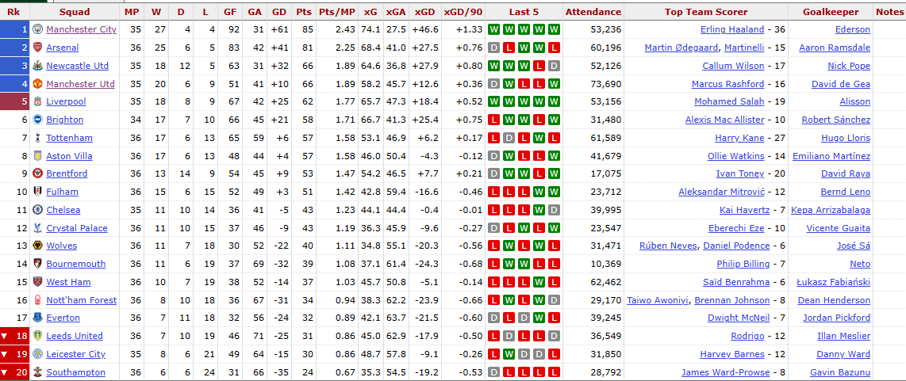
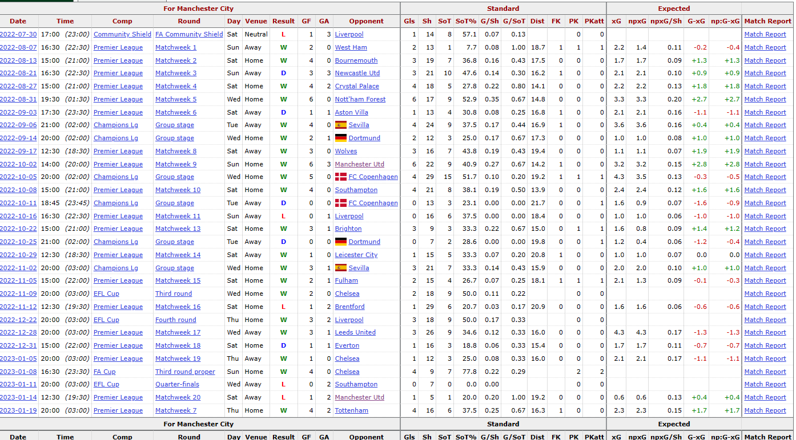
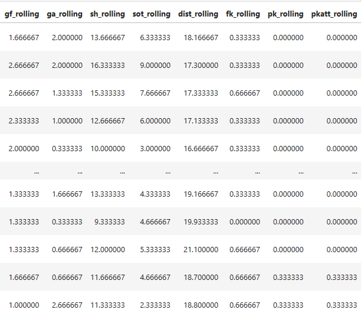
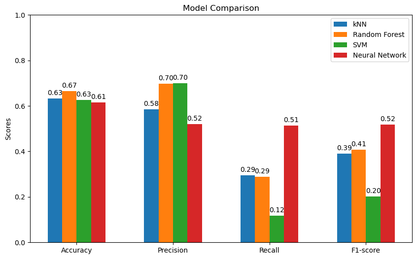
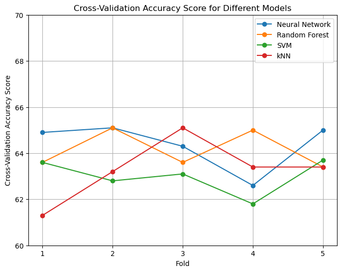

# Báo cáo Máy Học

### Nhóm 18: Trịnh Long Vũ, Trần Bùi Tuấn Ngọc

# Dự đoán đội chiến thắng trong trận đấu giải Ngoại Hạng Anh - Premier League

## 1. Giới thiệu

Bóng đá là bộ môn thể thao phổ biến nhất trên thế giới. Một số quốc gia có nhiều đội bóng thi đấu ở giải đấu vô địch khu vực và cấp quốc gia. Trong số các giải vô địch quốc gia trên thế giới thì đề tài này chủ yếu tập trung vào giải Ngoại Hạng Anh (Premier League), nơi giải đấu có nhiều người xem nhất trên thế giới.

### 1.1. Mục tiêu

- Xây dựng được mô hình dự đoán một trận đấu bóng đá và so sánh độ chính xác giữa các phương pháp phân lớp (đạt độ chính xác hơn 50% và duy trì được 60%).
- Giải thích được các yếu tố ảnh hưởng đến kết quả của các trận đấu diễn ra.

### 1.2. Giới hạn

- Dữ liệu (dataset) được lấy từ trang [fbref](https://fbref.com/en/comps/9/Premier-League-Stats)
- Thuật toán được sử dụng để xây dựng mô hình gồm có: RandomForest, SVM, kNN và Neural Network

## 2. Chuẩn bị dữ liệu

### 2.1. Thu thập dữ liệu

Dữ liệu được tổng hợp ở bảng: "Regular season" [ở đây](https://fbref.com/en/comps/9/Premier-League-Stats) và chi tiết dữ liệu cho từng đội ở bảng "Shotting"


<em>Dữ liệu ở bảng Regular season</em>


<em>Dữ liệu ở bảng Shooting của từng đội</em>

[Chi tiết code tại đây](scraping.ipynb)

### 2.2. Sơ chế dữ liệu (Data Wrangling)

Dữ liệu ta tổng hợp được có các đặc trưng:

- date: Ngày diễn ra trận đấu
- time: Thời gian diễn ra trận đấu
- comp: Giải đấu
- round: Vòng đấu
- day: Thứ trong tuần
- venue: Địa điểm tổ chức trận đấu
- result: Kết quả trận đấu
- gf: Số bàn thắng của đội chủ nhà
- ga: Số bàn thua của đội chủ nhà
- opponent: Đội đối thủ
- xg: Xếp hạng xG (Expected Goals) của đội chủ nhà
- xga: Xếp hạng xG (Expected Goals) của đội đối thủ
- poss: Tỷ lệ kiểm soát bóng của đội chủ nhà
- attendance: Số lượng khán giả có mặt
- captain: Đội trưởng của đội chủ nhà
- formation: Hệ thống chiến thuật của đội chủ nhà
- referee: Trọng tài
- match report: Báo cáo trận đấu
- notes: Ghi chú
- sh: Số cú sút của đội chủ nhà
- sot: Số cú sút trúng đích của đội chủ nhà
- dist: Tổng quãng đường chạy của đội chủ nhà
- fk: Số lượt sút phạt của đội chủ nhà
- pk: Số lượt sút penalty của đội chủ nhà
- pkatt: Số lượt sút penalty thực hiện của đội chủ nhà
- season: Mùa giải
- team: Tên đội chủ nhà

Các cột dữ liệu trên cung cấp thông tin về kết quả, số liệu thống kê và các yếu tố liên quan đến trận đấu và đội bóng chủ nhà.

Các cột như "gf", "ga", "xg", "xga", "poss", "sh", "sot", "dist", "fk", "pk", "pkatt" là các chỉ số thể hiện khả năng tấn công và phòng thủ của đội bóng chủ nhà trong trận đấu.

Thông qua việc phân tích và xử lý dữ liệu này, ta có thể trích chọn đặc trưng (Feature Selection) để dự đoán kết quả và đội chiến thắng trong các trận đấu giải Ngoại Hạng Anh.
Xóa các đặc trưng không cần thiết

Có 2 đặc trưng không cần thiết mà lúc thu thập dữ liệu ta đã lấy

```python
del matches["comp"]
del matches["notes"]
```

Chuyển đổi dữ liệu đúng định dạng

```python
matches["date"] = pd.to_datetime(matches["date"])
matches["venue_code"] = matches["venue"].astype("category").cat.codes
matches["opp_code"] = matches["opponent"].astype("category").cat.codes
matches["hour"] = matches["time"].str.replace(":.+", "", regex=True).astype("int")
matches["day_code"] = matches["date"].dt.dayofweek
```

[Chi tiết code tại đây](data_clean_and_preprocessing.ipynb)

### 2.3. Trực quan hóa dữ liệu (Data Visualisation)


<em>Figure 1. Phân bố kết quả trận đấu</em>


<em>Figure 2. Biểu đồ cho các đặc trưng</em>


<em>Figure 3. Tổng số bàn thắng của từng đội theo mùa giải</em>


<em>Figure 4. Phân bố sút phạt penalty</em>


<em>Figure 5.Biểu đồ boxplot cho xếp hạng xG của đội chủ nhà theo giải đấu</em>


<em>Figure 6. Trực quan hóa phân phối của số bàn thắng của đội chủ nhà</em>


<em>Figure 7. Biểu đồ tương quan giữa xếp hàng xg và số bàn thắng</em>


<em>Figure 8. Biểu đồ tương quan giữa kiểm soát bóng và số bàn thắng</em>


<em>Figure 9. Biểu đồ tương quan giữa xếp hàng xg và tỷ lệ kiểm soát bóng</em>


<em>Figure 10. Biểu đồ tương quan giữa tỷ lệ kiểm soát bóng và số cú sút của đội chủ nhà</em>


<em>Figure 11. Biểu đồ tương quan giữa tỷ lệ kiểm soát bóng và số cú sút của đội chủ nhà</em>


<em>Figure 12. Biểu đồ tương quan giữa số lượng khán giả có mặt và số bàn thắng đội nhà</em>


<em>Figure 13. Biểu đồ heatmap để hiển thị ma trận tương quan giữa các biến</em>

[Chi tiết code tại đây](Data%20Visualisation/data_visualization.ipynb)

### 2.4. Trích chọn đặc trưng (Feature Selection)

Thực hiện trích chọn đặc trưng, sử dụng SelectKBest để chọn K đặc trưng quan trọng nhất


<em>Figure 14. Biểu đồ các đặc trưng được chọn</em>

## 3. Chọn mô hình và huấn luyện

Đồ án sẽ xây dựng các mô hình giúp dự đoán kết quả trận đấu.

Lấy dữ liệu 'matches 2019-2023.xls'
Phân chia dữ liệu thành 2 tập: Training Set ( date<'2022-01-01') và Test Set (date >'2022-01-01').

Khởi tạo mô hình, nhận thuật toán phân lớp thông qua tham số clf (classifier) của hàm.

Đánh giá mô hình bằng Kiểm chứng chéo (Cross Validation) trên Training Set

Đánh giá 4 hệ số: Accuracy (Độ chính xác tổng quát), Precision (Độ chính xác), Recall (Độ nhạy), F1.

Vẽ Confusion Matrix cho kết quả dự đoán của mô hình trên Test Set.

Các thuật toán lựa chọn và sử dụng từ thư viện scikit-learn. Tất cả mô hình được tối ưu hóa bằng cách sử dụng grid search

- SVM
- K-Nearest Neighbour
- RandomForest
- Neural Network

### 3.1. Đánh giá nhanh độ chính xác của mô hình

Ta kiểm tra nhanh độ chính xác của mô hình bằng cách sử dụng thuật toán RandomForest

```
accuracy score:  0.600739371534196
precision score:  0.48736462093862815
recall score:  0.3176470588235294
f1 score:  0.3846153846153846
```

| predicted |  0  |  1  |
| --------- | :-: | :-: |
| actual    |     |     |
| 0         | 515 | 142 |
| 1         | 290 | 135 |

Nhận thấy accuracy score khá ổn tuy nhiên precision score chỉ xấp xỉ 0.48, số lần dự đoán đúng thực thế khá thấp vì thế cần tiến hành cải thiện độ chính xác cho mô hình

### 3.2. Tối ưu tập dữ liệu

Ta tính mức trung bình hiệu suất của đội bóng qua các trận đấu là các đặc trưng: ghi được bao nhiêu bàn thắng, số cú sút
Tiến hành gom dữ liệu theo từng đội bóng và tính toán trung bình luân phiên dữ liệu của 3 tuần trước đó để chuyển dữ liệu đó vào tuần thứ tư

```
def rolling_averages(group, cols, new_cols):
    group = group.sort_values("date")
    rolling_stats = group[cols].rolling(3, closed='left').mean()
    group[new_cols] = rolling_stats
    group = group.dropna(subset=new_cols)
    return group

cols = ["gf", "ga", "sh", "sot", "dist", "fk", "pk", "pkatt"]
new_cols = [f"{c}_rolling" for c in cols]

matches_rolling = matches.groupby("team").apply(lambda x: rolling_averages(x, cols, new_cols))
matches_rolling = matches_rolling.droplevel('team')
matches_rolling.index = range(matches_rolling.shape[0])
```



## 4. Đánh giá và điều chỉnh mô hình

Mục tiêu: sử dụng các mô hình máy học để dự đoán đội bóng chiến thắng.

Mô hình ban đầu được tạo và được sử dụng tập huấn luyện (X_train, y_train) để huấn luyện. Sau đó mô hình sẽ được dự đoán kết quả dựa trên tập test (X_test) và lưu trữ kết quả dự đoán ở preds

Tiếp theo tính toán confusion matrix và các chỉ số đánh giá như accuracy_score, precision_score, recall_score và f1_score

### 4.1. kNN (K-Nearest Neighbors)

Các chỉ số sau khi xây dựng mô hình có kết quả

```
accuracy score:  0.5882352941176471
precision score:  0.48175182481751827
recall score:  0.3728813559322034
f1 score:  0.4203821656050956
```

Thực hiện tìm giá trị k tốt nhất từ 1-50 và tính độ chính xác (accuracy) của mô hình với mỗi giá trị k.

Sau đó, vẽ biểu đồ với trục x là giá trị k và trục y là độ chính xác, để tìm giá trị tốt nhất cho k.


<em>Figure 15. Biểu đồ thử nghiệm giá trị của k</em>

Các chỉ số sau khi chọn lại K

```
accuracy score:  0.5882352941176471
precision score:  0.48175182481751827
recall score:  0.3728813559322034
f1 score:  0.4203821656050956

Cross-Validation Accuracy Score:  63.3 %
```

Tiếp theo sử dụng phương pháp cross-validation với 5 fold để đánh giá hiệu suất của mô hình. Sau đó, vẽ biểu đồ hiển thị ma trận nhầm lẫn (Confusion Matrix) của mô hình


<em>Figure 16. Biểu đồ Confusion Matrix của kNN </em>

Cuối cùng vẽ đường cong học tập (learning curve) của mô hình, biểu thị sự thay đổi của độ chính xác trên tập huấn luyện và tập kiểm tra khi kích thước tập huấn luyện thay đổi.


<em>Figure 17. Learning Curve của kNN </em>

[Chi tiết code tại đây](knn/predict_knn.ipynb)

### 4.2. Random Forest

Các chỉ số sau khi xây dựng mô hình có kết quả

```
accuracy score:  0.6312217194570136
precision score:  0.5636363636363636
recall score:  0.3502824858757062
f1 score:  0.43205574912891986
```

Tiếp theo xây dựng một lưới các siêu tham số (param_grid) để tìm giá trị tốt nhất cho mô hình RandomForestClassifier.

GridSearchCV được sử dụng để tìm kiếm trên lưới các siêu tham số và đánh giá hiệu suất của mô hình trên các tập chia khác nhau (cross-validation).

Kết quả tốt nhất được lưu trữ trong best_params.

Các chỉ số của mô hình mới được huấn luyện

```
Accuracy score: 0.665158371040724
Precision score: 0.6986301369863014
Recall score: 0.288135593220339
F1 score: 0.40800000000000003

Cross-Validation Accuracy Score:  64.1 %
```


<em>Figure 18. Biểu đồ Confusion Matrix của Random Forest </em>


<em>Figure 19. Learning Curve của Random Forest </em>


<em>Figure 20. Biểu đồ Feature Importance </em>

[Chi tiết code tại đây](rf/predict_rf.ipynb)

### 4.3. SVM

Các chỉ số sau khi xây dựng mô hình có kết quả

```
Accuracy score: 0.6063348416289592
Precision score: 0.6363636363636364
Recall score: 0.03954802259887006
F1 score: 0.07446808510638299
```

Tiếp theo tìm giá trị tốt nhất cho tham số C


<em>Figure 21. Biểu đồ test tham số C của SVM </em>

Sau đó, chúng ta tạo một mô hình SVM mới với tham số C tốt nhất (best_c), sử dụng kernel 'rbf', và huấn luyện mô hình này trên dữ liệu huấn luyện (X_train, y_train).

Các chỉ số của mô hình mới được huấn luyện

```
Accuracy score: 0.6266968325791855
Precision score: 0.7
Recall score: 0.11864406779661017
F1 score: 0.20289855072463767

Cross-Validation Accuracy Score:  63.0 %
```


<em>Figure 22. Biểu đồ Confusion Matrix của SVM </em>


<em>Figure 23. Learning Curve của SVM </em>

[Chi tiết code tại đây](svm/predict_svm.ipynb)

### 4.4. Neural Network

Tạo và huấn luyện mô hình MLP với các tham số cố định, bao gồm hidden_layer_sizes (kích thước các tầng ẩn), max_iter (số lần lặp tối đa), và random_state (nguồn số ngẫu nhiên).

Các chỉ số sau khi xây dựng mô hình có kết quả

```
Accuracy score: 0.6085972850678733
Precision score: 0.5102040816326531
Recall score: 0.5649717514124294
F1 score: 0.5361930294906166
```

Sử dụng GridSearchCV để tìm kiếm siêu tham số tốt nhất dựa trên param_grid và dữ liệu huấn luyện.

Các chỉ số của mô hình mới được huấn luyện

```
Accuracy score: 0.6153846153846154
Precision score: 0.5636363636363636
Recall score: 0.1751412429378531
F1 score: 0.26724137931034486

Cross-Validation Accuracy Score:  64.4 %
```


<em>Figure 24. Biểu đồ Confusion Matrix của MLP</em>


<em>Figure 25. Mô hình MLP với các kích thước tầng ẩn khác nhau</em>

[Chi tiết code tại đây](mlp/predict_mlp.ipynb)

## 5. Đánh giá mô hình

### 5.1. Đánh giá giữa các mô hình

Dưới đây là biểu đồ so sánh các hệ số đánh giá giữa các mô hình máy học đã được xây dựng để giải quyết bài toán ban đầu. Gồm có 4 giá trị: Accuracy (Độ chính xác tổng quát), Precision (Độ chính xác), Recall (Độ nhạy), F1.

<em>Figure 26. So sánh các hệ số giữa các mô hình</em>


<em>Figure 27. So sánh Cross-Validation Accuracy Score giữa các mô hình</em>

[Chi tiết code tại đây](Evaluation.ipynb)

<!-- Accuracy: Mô hình Random Forest có điểm số cao nhất với khoảng 0.665, tiếp theo là SVM (0.626), kNN (0.633) và Neural Network (0.615). Tuy nhiên, sự khác biệt giữa các mô hình không lớn.

Precision: Mô hình SVM có độ chính xác (precision) cao nhất với khoảng 0.7, tiếp theo là Random Forest (0.698), kNN (0.584) và Neural Network (0.52).

Recall: Mô hình Neural Network có khả năng phát hiện các dữ liệu positive (recall) cao nhất với khoảng 0.514, tiếp theo là kNN (0.294), Random Forest (0.288) và SVM (0.118).

F1-score: Mô hình Random Forest có F1-score cao nhất với khoảng 0.408, tiếp theo là Neural Network (0.517), kNN (0.391) và SVM (0.202). -->

<!-- Random Forest có vẻ có hiệu suất tốt nhất với các chỉ số Accuracy và F1-score cao nhất trong số các mô hình. Do đó, nếu bạn muốn chọn một mô hình duy nhất, có thể xem xét mô hình Random Forest như một lựa chọn tiềm năng. Tuy nhiên, cần xem xét kỹ càng và điều chỉnh các siêu tham số của mô hình để đạt hiệu suất tốt nhất trong bối cảnh cụ thể của bài toán của bạn. -->
<!--
Recall: Mô hình Neural Network có giá trị Recall cao nhất với khoảng 0.514, tiếp theo là kNN (0.293), Random Forest (0.242) và SVM (0.118). Recall đo lường khả năng của mô hình trong tìm ra các trường hợp Positive. Mô hình Neural Network có khả năng tìm ra các trường hợp Positive tốt nhất, trong khi SVM có khả năng tìm ra các trường hợp Positive thấp nhất trong số các mô hình.

F1-score: Mô hình Neural Network có giá trị F1-score cao nhất với khoảng 0.517, tiếp theo là Random Forest (0.408), kNN (0.391) và SVM (0.202). F1-score là một chỉ số kết hợp giữa Precision và Recall, đo lường sự cân bằng giữa độ chính xác và khả năng tìm ra các trường hợp Positive. Mô hình Neural Network đạt được một sự cân bằng tốt giữa Precision và Recall, trong khi SVM có F1-score thấp nhất trong số các mô hình. -->

### 5.2. Lựa chọn mô hình

Nếu độ chính xác là yếu tố quan trọng nhất: thì có thể chọn mô hình Random Forest, vì nó có độ chính xác tương đối cao.

Nếu khả năng phát hiện và phân loại đúng các mẫu là ưu tiên: có thể chọn Neural Network hoặc kNN, vì cả hai mô hình này có recall và F1-score cao hơn so với các mô hình khác.

Nếu cân bằng giữa precision và recall: Trong trường hợp này, cả Neural Network và kNN có F1-score tương đối cao.

## 6. Kết luận

Với dữ liệu được chuẩn bị, sau khi thực hiện tiền xử lý dữ liệu, tối ưu lại dữ liệu thì đã xây dựng được mô hình dự đoán duy trì độ chính xác trung bình là 60% và có thể đạt tới 70%

Tuy nhiên với sự khắc nghiệt của bóng đá giải Ngoại Hạng Anh nơi mà bất cứ kịch bản nào cũng có thể xảy ra thì 1 đội bóng được đánh giá thấp hơn cũng có thể có được chiến thắng. Đó cũng chính là vấn đề mà mô hình dự đoán này gặp phải.

Những việc sẽ được làm tiếp theo để cải thiện mô hình dự đoán

- Thu thập thêm nhiều dữ liệu của nhiều mùa trước đó
- Dùng thêm nhiều phương pháp khác nhau để giải quyết(PCA, LDA)
- Tìm thêm các đặc trưng ảnh hưởng đến kết quả dự đoán

[Thư mục dự án và dataset](https://github.com/trinhvu1711/Report-Machine-Learning-2023)
